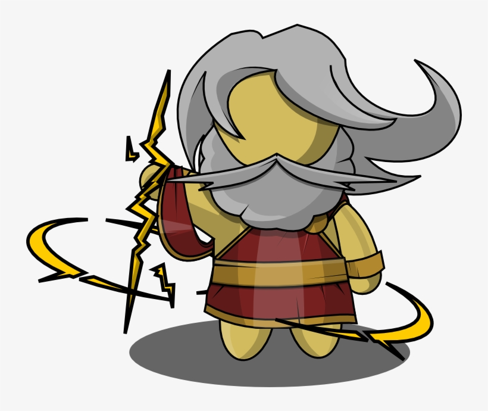

<p align="center">
  
</p>

<h1 align="center">Zeus</h1>

<p align="center">
  <a href="https://www.nuget.org/packages/Zeus.Abstractions"></a>
  
  <a href="https://github.com/Mokode-dev/Zeus/blob/main/code/LICENSE"></a>
</p>

<p align="center">
  <strong>From Olympus, orchestrating every device.</strong>
</p>

<p align="center">
  A .NET framework for industrial host applications.<br />
  Communications, protocols, acquisition, and lifecycle management are handled by the framework, while WinForms, WPF, or console apps can provide the UI.
</p>

<p align="center">
  <em>Leave the complexity to Zeus, and keep the user experience simple.</em>
</p>

<p align="center">
  <strong>English</strong> | <a href="README.zh-CN.md">简体中文</a>
</p>

---

## ✨ Features

- 🔌 **Channels** — Serial, TCP, UDP client/server, and virtual channels through one consistent API
- 📡 **Protocols** — Custom frames, Modbus RTU/TCP/ASCII, Mitsubishi MC 1E/3E/4E Binary/ASCII, Siemens S7 TCP, Omron FINS UDP/TCP, Omron Host Link ASCII, Panasonic MEWTOCOL-COM, and Allen-Bradley EtherNet/IP CIP, with virtual slave/PLC support
- 📊 **Acquisition** — Define a point table once, poll on intervals, keep the latest successful sample, calculate alarm limits, and write writable points back by name
- 🧭 **Tracing** — Channel-level TX/RX packet events, rolling in-memory records, file logging, and structured `ILogger` logs
- 🖥️ **UI agnostic** — Business code is not tied to WinForms or WPF; point tables can bind directly to text, historical trends, alarm colors, enabled states, and write buttons
- 🧾 **JSON configuration** — Change ports and slave addresses in the field without recompiling
- 🧪 **Hardware optional at first** — Virtual channels use the same programming model as real devices

## 🚀 Quick Start

```csharp
await using var app = ZeusHost.Create(builder =>
{
    builder.AddVirtualChannel("meter");
    // With hardware: builder.AddSerialPort("meter", "COM3", 115200);
});

await app.StartAsync();
var meter = app.Channels.Get("meter");
meter.DataReceived += (_, e) => { /* hand data to the UI */ };
await meter.WriteAsync("PING"u8.ToArray());
```

Desktop apps only need to swap the binding layer. The channel declaration stays the same:

```csharp
this.AttachZeus(builder => builder.AddVirtualChannel("meter"));
meter.BindTo(echoLabel);
app.Points.BindTo("temperature", temperatureLabel);
```

## 📦 Assemblies

| Package | Version | Downloads | Purpose |
| --- | --- | --- | --- |
| `Zeus.Abstractions` | [](https://www.nuget.org/packages/Zeus.Abstractions) | [](https://www.nuget.org/packages/Zeus.Abstractions) | Contracts for channels, devices, point tables, and hosting |
| `Zeus.Runtime` | [](https://www.nuget.org/packages/Zeus.Runtime) | [](https://www.nuget.org/packages/Zeus.Runtime) | Runtime core: channel state machines, device base classes, and point tables |
| `Zeus.Hosting` | [](https://www.nuget.org/packages/Zeus.Hosting) | [](https://www.nuget.org/packages/Zeus.Hosting) | Host integration and acquisition loop |
| `Zeus.Communications` | [](https://www.nuget.org/packages/Zeus.Communications) | [](https://www.nuget.org/packages/Zeus.Communications) | Serial / TCP / UDP clients and servers / virtual channels |
| `Zeus.Protocols.Framing` | [](https://www.nuget.org/packages/Zeus.Protocols.Framing) | [](https://www.nuget.org/packages/Zeus.Protocols.Framing) | Custom frame support |
| `Zeus.Protocols.Modbus` | [](https://www.nuget.org/packages/Zeus.Protocols.Modbus) | [](https://www.nuget.org/packages/Zeus.Protocols.Modbus) | Modbus RTU / TCP / ASCII |
| `Zeus.Protocols.Mc` | [](https://www.nuget.org/packages/Zeus.Protocols.Mc) | [](https://www.nuget.org/packages/Zeus.Protocols.Mc) | Mitsubishi MC 1E/3E/4E Binary/ASCII, including 3E/4E random read/write |
| `Zeus.Protocols.S7` | [](https://www.nuget.org/packages/Zeus.Protocols.S7) | [](https://www.nuget.org/packages/Zeus.Protocols.S7) | Siemens S7 TCP, reading/writing common DB/I/Q/M area types |
| `Zeus.Protocols.Fins` | [](https://www.nuget.org/packages/Zeus.Protocols.Fins) | [](https://www.nuget.org/packages/Zeus.Protocols.Fins) | Omron FINS UDP/TCP, reading/writing CIO/WR/HR/AR/DM/EM/TIM-CNT areas |
| `Zeus.Protocols.HostLink` | [](https://www.nuget.org/packages/Zeus.Protocols.HostLink) | [](https://www.nuget.org/packages/Zeus.Protocols.HostLink) | Omron Host Link ASCII, reading/writing CIO/LR/HR/AR/DM areas |
| `Zeus.Protocols.Mewtocol` | [](https://www.nuget.org/packages/Zeus.Protocols.Mewtocol) | [](https://www.nuget.org/packages/Zeus.Protocols.Mewtocol) | Panasonic MEWTOCOL-COM, reading/writing DT/LD/FL data registers and X/Y/R/L contact words |
| `Zeus.Protocols.EtherNetIp` | [](https://www.nuget.org/packages/Zeus.Protocols.EtherNetIp) | [](https://www.nuget.org/packages/Zeus.Protocols.EtherNetIp) | Allen-Bradley EtherNet/IP CIP, reading/writing scalar tags and CIP attributes |
| `Zeus.Configuration` | [](https://www.nuget.org/packages/Zeus.Configuration) | [](https://www.nuget.org/packages/Zeus.Configuration) | JSON project configuration |
| `Zeus.Presentation.Abstractions` | [](https://www.nuget.org/packages/Zeus.Presentation.Abstractions) | [](https://www.nuget.org/packages/Zeus.Presentation.Abstractions) | UI-independent binding abstractions, `PointBindingSource`, and point snapshot binding |
| `Zeus.Presentation.WinForms` | [](https://www.nuget.org/packages/Zeus.Presentation.WinForms) | [](https://www.nuget.org/packages/Zeus.Presentation.WinForms) | WinForms binding, point alarm colors, and write button binding |
| `Zeus.Presentation.Wpf` | [](https://www.nuget.org/packages/Zeus.Presentation.Wpf) | [](https://www.nuget.org/packages/Zeus.Presentation.Wpf) | WPF binding, point alarm colors, and write button binding |

Join QQ group `771421105` to talk with other users. The QR code is available on the documentation [Community](https://docs.greekmythology.cn/docs/community) page.

## Support Zeus

If Zeus helps your project, you can sponsor it through the documentation [Support Zeus](https://docs.greekmythology.cn/docs/sponsor/) page or [Afdian](https://afdian.com/a/zeusnet). Enterprise support is also available by direct discussion. Regular sponsorship supports open-source maintenance; protocol adapters, on-site commissioning, and project integration should be discussed separately.

## 📄 License

[MIT](LICENSE)
